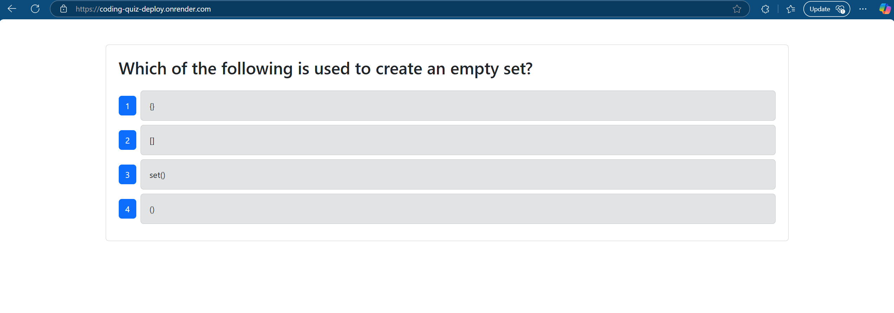

# 🚀 Tech Quiz Test Suite

A full-stack quiz application that implements **CI/CD (Continuous Integration & Deployment)** pipelines using **GitHub Actions** and **Render**. This project demonstrates automated testing via **Cypress** and hands-free deployment workflows, offering a modern solution for ensuring high-quality, production-ready code.

> ✅ Live App: [View Deployed App on Render](https://coding-quiz-deploy.onrender.com/)  
> 🔗 GitHub Repo: [GitHub Repository](https://github.com/Amarrero0215/tech-quiz-test-suite)

---

## 📸 Screenshot



---

## 🧠 Description

The Tech Quiz Test Suite challenges users with Python-related questions through a sleek, full-stack quiz interface. The project was built as part of the **Module 19 Challenge**, emphasizing CI/CD best practices to:

- ✅ Ensure **tests run automatically** when pull requests target the `develop` branch.
- ✅ Automatically **deploy the app to Render** when the `develop` branch is merged into `main`.

---

## 🧪 Tech Stack

- **Frontend**: React, Tailwind CSS  
- **Backend**: Node.js, Express.js, MongoDB  
- **Testing**: Cypress  
- **CI/CD**: GitHub Actions, Render  
- **Deployment**: Render (manual auto-deploy disabled; hooked via GitHub Actions)

---

## 🎯 Features

- 🔁 Real-time multiple-choice quiz with auto-evaluation
- 📊 Tracks correct/incorrect answers
- 🧢 Fully integrated component testing using Cypress
- 🔄 Automatic test workflow on PR to `develop`
- 🚀 Auto-deployment to Render on merge to `main`

---

## 🛠️ Installation & Usage

Clone the repository and install dependencies:

```bash
git clone https://github.com/alex-dev/tech-quiz-test-suite.git
cd Develop/server
npm install
```

### 📦 Build

```bash
npm run build
```

### 🔢 Seed the Database

```bash
npm run seed
```

### 🥠 Run Tests Locally

```bash
npm run test
```

---

## ⚙️ GitHub Actions Workflows

### ✅ CI – Cypress Testing on `develop` Pull Requests

- Trigger: PR to `develop`
- Action: Runs all Cypress component tests
- Result: Pass/fail status visible on GitHub PR

### 🚀 CD – Auto Deployment to Render on `main` Merge

- Trigger: Merge into `main`
- Action: Uses Render Deploy Hook to update live app
- Deploy Hook stored in GitHub secrets as `RENDER_DEPLOY_HOOK`

---

## 📂 File Structure

```bash
tech-quiz-test-suite/
️
├── client/              # Frontend
├── server/              # Backend
│   ├── config/
│   ├── models/
│   ├── routes/
│   ├── seeds/
│   ├── tests/
│   └── ...
├── .github/workflows/   # GitHub Actions
│   ├── test.yml
│   └── deploy.yml
└── README.md
```

---

## 🔐 Secrets & Environment Variables

You will need the following GitHub secrets configured:

| Name                 | Description                         |
|----------------------|-------------------------------------|
| `RENDER_DEPLOY_HOOK` | Render deploy webhook URL           |
| `RENDER_API_KEY`     | (Optional) For extended Render API  |

---

## 👨‍💼 Author

**Alex Marrero**  
[GitHub](https://github.com/alex-dev)  
[LinkedIn](https://www.linkedin.com/in/alex-marrero)

---

## 📄 License

This project is protected under copyright and modification terms.  
**Only team members explicitly named in the original repo are authorized to modify this code.**

---

## 📝 Acknowledgements

- [Render Documentation](https://render.com/docs)
- [GitHub Actions Docs](https://docs.github.com/en/actions)
- [MongoDB Atlas](https://www.mongodb.com/atlas)
- [Cypress Testing](https://www.cypress.io/)

---

> “Quality code isn’t tested after it’s written — it’s tested as it’s built.”

